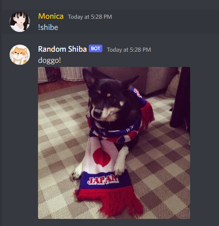

# Random Shiba &#128021;

Random Shiba is a simple Discord bot that generates random photos of Shiba Inus with the command `!shibe`

## Resources used

- [Shibe.online](https://shibe.online/)

## Installation

1. Clone the repository.

```sh
  git clone https://github.com/nicabee/Random-Shiba-Discord-Bot.git
```

2. Install NPM packages.

```sh
   npm install
```

3. Get a token for the bot via [Discord Developer Portal](https://discord.com/developers/applications). Full tutorial
   can be found [here](https://youtu.be/F5KpcwtBk1E?t=397).

4. Create an `.env` file from the existing `.env.example`.

5. Run the bot using `nodemon index.js`.

## Screenshots


